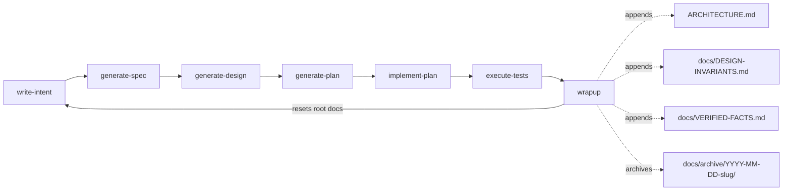

# Sdlc Skills — Architecture

Long-lived index. Unlike `intent.md`/`spec.md`/`design.md`/`plan.md`/`STATE.md`, this
file is never reset — `wrapup` appends to it at the end of every cycle. It is the sum of
every cycle's specifications plus the decisions made along the way, not a from-scratch
description of the system.

## Executive overview

`SDLC-skills` provides Claude Code skills implementing an agent-centered SDLC loop
(`write-intent` → `generate-spec` → `generate-design` → `generate-plan` →
`implement-plan` → `execute-tests` → `wrapup`), adapted from
https://claude.com/blog/the-ai-native-sdlc-playbook per `AGENTS.md`. Each stage is a
`skills/<name>/SKILL.md`, packaged as the `sdlc-skills` Claude Code plugin (`README.md`).
`wrapup` is the only stage that writes to this file,
to `docs/DESIGN-INVARIANTS.md`, and to `docs/VERIFIED-FACTS.md`.

## Cycle index

| Date | Slug | Summary | Archive |
|---|---|---|---|
| 2026-09-13 | `create-docs-archive-so-wrapup-has-somewhere-to-archive-into` | Added `docs/archive/.gitkeep` and made `wrapup` check the directory exists before `git mv`-ing cycle docs into it, instead of assuming it. First live test of the full 7-stage cycle. | [spec](docs/archive/2026-09-13-create-docs-archive-so-wrapup-has-somewhere-to-archive-into/spec.md) · [design](docs/archive/2026-09-13-create-docs-archive-so-wrapup-has-somewhere-to-archive-into/design.md) |
